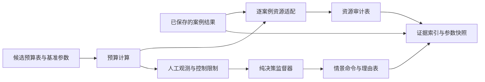

# 仿真模块边界与扩展入口

## 数据流

`baseline_case` 和 `experiment_matrix` 给出独立案例；`faultInjection` 生成该案例的参数和控制策略；`propagateCase` 管理 ODE 分段、控制事件及只读诊断事件；`computeMetrics` 从结果计算事后指标；`summarizeRuns` 和可视化模块只消费结果。动力学函数不解释策略名称，控制策略不计算评价指标。

`result` 保存 `config`、`time_s`、`state_SI`、`mode`、`eventLog`、`status` 和 `metrics`。`window_down` / `window_up` 仅记录密切远地点穿越 500 km，不触发控制动作。`windowExitMetrics` 是纯分析函数，可用人工构造的事件序列单独测试。密切轨道几何由 `osculatingOrbit` 提供，传播和分析共用同一公式。

`analyzeSwitchNeighborhood` 单独诊断展帆前后一圈的密切轨道尺度。当前控制仍用瞬时半长轴下穿触发；诊断表用于判断 J2 周期摆动是否使“整圈已降至切换高度”的说法失真，不参与在线控制。

`classifySwitchTradeoff` 只读取汇总表，以窗口退出时间、120 km 时间和推进剂为三个越小越好的目标，按 `p.analysis` 中预设容差判断非劣点。未观察到窗口退出或未到 120 km 的案例不会被填入虚构完成时间，而是单独标为 `excluded`。这是一组给定扫描点的比较，不是连续空间的自动优化。

## 增加需求时

| 需求 | 主要入口 | 必须同步检查 |
|---|---|---|
| 新卫星或环境情景 | `config/baseline_case.m`、`experiment_matrix.m` | `validateCase`、参数来源、全部关联实验 |
| 新控制策略 | `controlPolicy.m`、`deorbitStateMachine.m` | 故障动作、事件与资源测试；保持对照组同质量同环境 |
| 新物理力 | `src/dynamics/`、`orbitalDynamics.m` | 方向/极限测试、数值对照、参数单位 |
| 新观察指标 | 独立事件函数及 `computeMetrics.m` | 删失规则、回升/边界测试、`summarizeRuns` 和图表 |
| 新图表 | `src/visualization/` | 仅使用已保存结果；调用共享 `styleFigure` |

目前 `mission.deadline_s=NaN` 表示没有研究硬期限，`sim.maxDuration_s` 只限制计算。窗口退出是已计算轨迹内的事后观察，不是在线控制判据。若要增加“退出窗口后才交接”的控制方案，应定义可在轨计算的触发条件并作为新策略与原 P 公平比较，不能把事后的最后一次退出时间直接用于实时决策。

## 第 1 次补充（2026-09-27 12:49:35 +08:00）：工程预算的应用层边界

`loadEngineeringBudget` 只读取 `config/engineering_budget_candidate.csv`；`computeEngineeringBudget(p,ledger,operations)` 是纯分析函数，输入由轨道参数、预算表及可选的案例汇总表构成，不读取文件，也不认识 `result` 内部字段。`run_engineering_audit` 才负责把传播结果的案例名、累计点火秒数和推进剂消耗映射为 `operations`，并导出 CSV。`run_all` 仅在基准组完成后调用该适配层。数据方向固定为“参数/候选账本/已有结果 → 预算分析 → 报告”，审计状态不会反向修改 `p`、`mode` 或轨迹。

预算表列为 `itemId,kind,mode,value,unit,status,notes`。`kind` 当前支持 `mass`、`power_available`、`power_load` 和 `condition`；每个功率模式由一行 `power_available` 声明，共同负载使用 `mode=all`。增加子系统或模式时，先在表内增加互不重叠的质量项、模式可用功率及相应负载，计算函数会按模式汇总，无需改传播器。`propellant` 必须与 `p.sc.propellant_kg` 一致；`thruster_input` 和 `same_thruster_workpoint` 是推进器数量级检查的显式输入。预算含未知项时保留缺失值；已知部分超过总质量或可用功率时直接标为 `fail`。

当前 S0/S1/S2/S3/SAFE 只是静态功率预算用的概念模式，不能据此声称传播器已实现实时能源调度。若未来需要功率不足触发停推等闭环动作，应先定义独立监督器与传播器的命令接口，并单独评审 `propagateCase` 的改动；本次工程预算没有修改该文件。

## 第 2 次补充（2026-09-27 13:43:53 +08:00）：逐案例审计、监督器与证据索引

`assessCaseResources(pCase,pBase,ledger,facts)` 是纯分析入口，`facts` 只含案例名、组名、点火秒数、燃料、最大展帆比例及推力和帆是否同时工作；它不依赖轨迹结构。`run_case_resource_audit` 才负责读取六组已保存的 MAT 结果并适配这些字段。推力偏离基准时，将推进器干质量和输入功率设为未知；新增帆面积偏离基准时，将帆机构质量设为未知。F2 的并行推力/半展帆组合功率不沿用单独 S1 余量。输出状态与原因码见 `results/tables/resource_case_audit.csv`。

`deorbitSupervisor(obs,memory,limits)` 是纯决策函数。`obs` 包含退役许可、可用功率、姿态、推进器健康、剩余燃料、是否达到切换条件、是否到达模型终点和帆状态；`memory` 记录上一阶段及是否已经发出展帆命令；`limits` 是独立预算提供的基础/推进/展帆静态负载。输出命令、下一记忆和原因码，未知观测默认停推并进入安全模式。`run_supervisor_scenarios` 用人工观测生成 `supervisor_scenarios.csv`，并不连接真实传感器、供电调度或传播器。它与原 `controlPolicy`/`deorbitStateMachine` 相互独立，原 B0/B1/B2/P 和 F1-F4 保持原控制。

`buildEvidenceIndex` 记录每个预期结果的相对路径、生成函数、角色、是否存在和大小，另存本次 `p` 与预算表快照、MATLAB 版本、Git 提交状态和候选输入状态。`missingCount=0` 仅表示清单中的文件都存在，不能证明数据来源已认证或已跨机复现。后续增加新案例/输出时，应同步更新证据清单映射。要让监督器真实改变轨迹，必须另行设计积分片段边界的命令接口并修改 `propagateCase`；本次没有这项改动，也不能把人工情景称为闭环飞行验证。
