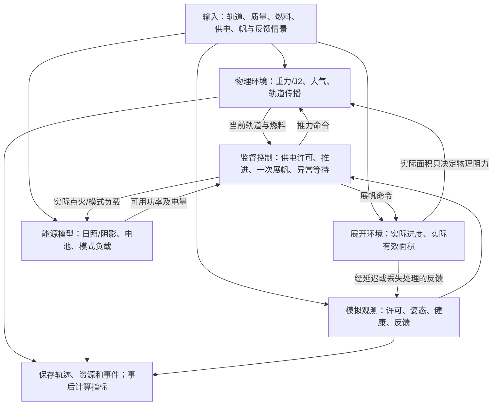
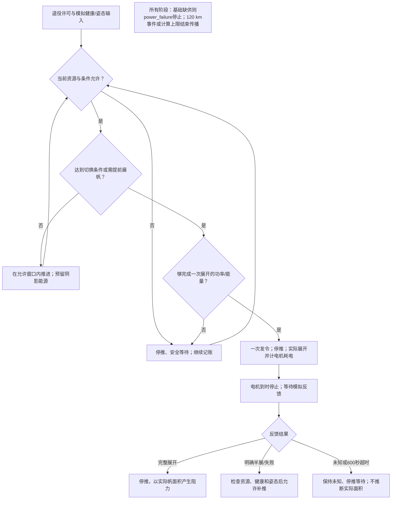

# 主案例说明与系统图

## 一句话说明

一颗50 kg假想低轨卫星退役后，在燃料和供电约束下先用低推力降轨，再展开阻力帆；比较离开原轨道窗口和到120 km的时间、燃料与电量，并验证反馈异常时的动作。本项目为概念仿真＋设备参数对照，不是实际飞行认证。

## 当前主案例是谁

正式标识为 `A2_NORMAL_120`，来自 `experiment_matrix('deployment_a2')` 第3项。不要与原四策略中的P、A1瞬时展开基准或BHT-200参数对照混淆。

| 项目 | 当前设定 | 性质 |
|---|---|---|
| 初始轨道/质量 | 550 km近圆轨道、53°倾角、50 kg | 团队代表场景 |
| 推进 | 20 mN、1200 s、0.8 kg推进剂；允许窗口50% | 概念工作点，非完整设备选型 |
| 帆 | 新增有效迎风面积10 m²；正常展开期间线性增加 | 面积代理，非姿态/机构动力学 |
| 供电 | 向阳650 W；固定初始轨道阴影模型 | 寿命末期可用功率研究假设 |
| 电池 | 300 Wh、初始80%、保护线20%；充/放电效率各90% | 候选储能模型 |
| 电力调度 | 提前预留阴影基础用电及10%额外余量 | 已确认候选演示设置，不称全局最优 |
| 模式功率 | 推进560 W、安全等待230 W、帆监测215 W、展开240 W | 同一工程账本；展开含机构额外30 W |
| 切换/展开 | 瞬时密切半长轴下穿350 km；展开120秒 | 团队控制定义，不代表整圈已低于350 km |
| 反馈 | 实际过程结束后10秒正常确认；发令后600秒无反馈即超时 | 模拟反馈，非传感器实测 |
| 评价终点 | 瞬时地心高度下降穿过120 km | 计算界面，不证明烧毁或落区安全 |

## 系统关系图

关键隔离：模拟器知道实际帆面积，但控制器只能使用收到的反馈；不能从隐藏真实状态直接决定补推。窗口“最后一次退出”由完整轨迹事后计算，不作为控制器的未来信息。

## 控制流程图

该图是已实现的概念控制流程，不是经过飞行安全认证的控制器。明确失败后的补推仍未证明真实帆/推进器干涉安全；未知状态停推也不能被宣传为对所有机构绝对安全。

## 结果与证据

当前统一验证目录 `results/current_20260930_200345_605/a2/tables/`：主案例到120 km **9.832460天**，燃料 **0.441840 kg**，窗口退出 **3.217647天**，最低电量 **79.958477 Wh**，机构额外能耗 **1 Wh**，没有记录基础缺供。参见deployment_summary.csv、deployment_resources.csv、deployment_audit.csv及resolution_check.csv。

这些数字只适用于当前输入。原P约8.89天采用不同控制条件，不可直接将差值归因于展帆延迟；应与A2_IDEAL约9.831665天比较。半展开可能因继续推进而更快，但燃料更多，不能解释为故障有益。

## 下一步：关键输入不确定性

用户已选首轮仅检查中等单因素：585 W、270 Wh、初始70%、公共负载＋10%，另有同配置基准。组合与较大扰动暂不运行。保持本主案例及控制规则，不为使案例通过而更改阈值；结果见《关键输入不确定性_第一轮结果》，不计算真实成功概率。
